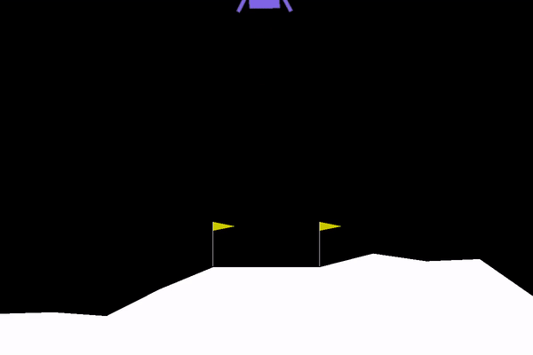
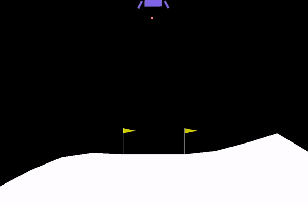
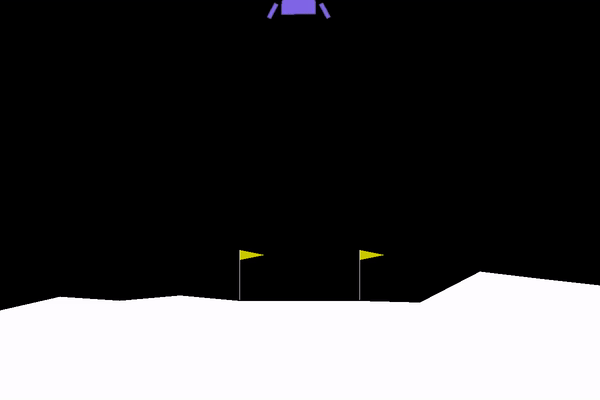

# Reinforcement-Learning-Pytorch
Reinforcement Learning Algorithms with Pytorch and OpenAI's Gym.

This repository holds some implementations of reinforcement learning algorithms with Pytorch and Gym. 

## 1. Lunar Lander with Deep Q-Learning and Experience Replay

This project implements the [LunarLander-v2](https://gym.openai.com/envs/LunarLander-v2/) from OpenAI's Gym with Pytorch. The goal is to land the lander safely in the landing pad with the Deep Q-Learning algorithm.

### Introduction

Landing pad is always at coordinates (0,0). Coordinates are the first two numbers in state vector. Reward for moving from the top of the screen to landing pad and zero speed is about 100..140 points. If lander moves away from landing pad it loses reward back. Episode finishes if the lander crashes or comes to rest, receiving additional -100 or +100 points. Each leg ground contact is +10. Firing main engine is -0.3 points each frame. Solved is 200 points. Landing outside landing pad is possible. Fuel is infinite, so an agent can learn to fly and then land on its first attempt. Four discrete actions available: do nothing, fire left orientation engine, fire main engine, fire right orientation engine.

### Results

Episode 1|Episode 700|Episode 800|
:-------------------------:|:---------:|:-------:
|  ||

### Acknowledgement

- The lunar lander environment set up comes from [OpenAI' Gym](https://gym.openai.com/).
- The `rl_glue` set up and the idea of experimence replay come from the [Reinforcement Learning Specialization from Coursera](https://www.coursera.org/specializations/reinforcement-learning).
